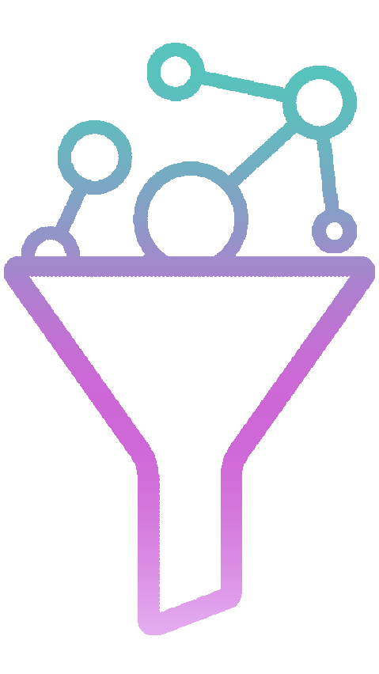

[![Releases][releases-shield]][releases-url]
[![Issues][issues-shield]][issues-url]

<!-- PROJECT LOGO -->
<br />
<p align="center">
  <a href="https://github.com/ajnavarro/gqlfiltergen">
    
  </a>

  <h3 align="center">gqlfiltergen</h3>

  <p align="center">
    Generate filter inputs for your GraphQL schema.
    <br />
    <br />
    <a href="https://github.com/ajnavarro/gqlfiltergen/issues">Report a Bug</a>
    ·
    <a href="https://github.com/ajnavarro/gqlfiltergen/issues">Request Feature</a>
  </p>
</p>

- [About The Project](#about-the-project)
- [Use Cases](#use-cases)
- [Documentation](#documentation)
  - [Installation](#installation)
  - [Base Filter Types](#base-filter-types)
  - [Composition Filters](#composition-filters)
  - [Extras](#extras)
  - [Usage](#usage)
    - [Generate Filters](#generate-filters)
    - [Use Filters in Queries](#use-filters-in-queries)
- [Contributing](#contributing)
- [License](#license)


## About The Project

`gqlfiltergen` is a tool designed to automate the generation of filter input types for your GraphQL schema. It simplifies the creation of complex filters such as `==`, `!=`, `EXISTS`, `<`, `>`, `LIKE`, and more, especially when you're not using a SQL database underneath.

It works as a plugin for [gqlgen library][gqlgen-url].

## Use Cases

This tool is particularly useful for:

- In-memory data filtering: Create filters to narrow down results from data stored in memory.
- Key/value databases: Enable filtering by any desired fields when using data backed by a key/value database.
- API consistency: Homogenize your input API to ensure all inputs work the same way across different queries.

## Documentation

### Installation

To install gqlfiltergen, add it as a plugin when initializing gqlgen api:

```go
api.Generate(cfg,
	api.AddPlugin(gqlfiltergen.NewPlugin(&gqlfiltergen.Options{
		InjectCodeAfter: queriesInject,
	})),
)
```

`InjectCodeAfter` contains all the queries and subscriptions that you want to add to the existing ones, but using the Filters that are going to be generated.

### Base Filter Types

- `eq` [FilterString|FilterInt|FilterTime|FilterBoolean]: Check equality.
- `exists` [FilterString|FilterInt|FilterTime|FilterBoolean]: Check if the value exists and is not nil.
- `lt` [FilterInt]: Check that the value is less than the specified one on the filter.
- `gt` [FilterInt]: Check that the value is greater than the specified on the filter.
- `like` [FilterString]: Apply the provided regular expression to the field value.
- `before` [FilterTime]: Get elements with a date from before the specified one.
- `after` [FilterTime]: Get elements with a date after the specified one.

### Composition Filters

- `_and`: Logical operator that will combine two or more conditions, returning true if all of them are true.
- `_or`: Logical operator that will combine two or more conditions, returning true if at least one of them is true.
- `_not`: Logical operator that will reverse conditions of the nested filter.

### Extras

Extras are features that extract information from the provided filter objects. They might be useful for several use case, mainly to gather data that will make the filter more performant:

- `MINMAX`: Get the minimum and maximum value from the received filter. This is useful when you want to pre-filter data using a range.

### Usage

Begin by defining your GraphQL types in a schema file, e.g., `schema.graphql` and add the `@filterable` directive to the fields you want to filter:

```graphql
type User {
  id: Int! @filterable(extras:[MINMAX])
  name: String! @filterable
  age: Int @filterable
  email: String @filterable
  createdAt: Time @filterable
}
```

#### Generate Filters

Execute `go generate ./..` as specified at [gqlgen documentation](https://gqlgen.com/reference/plugins/).

After doing that, you will have a new input object, called `FilterUser`.

#### Use Filters in Queries

```graphql
query {
  users(where: {
    name: { like: "John.*" },
    age: { gt: 21 }
  }) {
    id
    name
    email
  }
}
```

## Contributing

Contributions are what make the open-source community such an amazing place to learn, inspire, and create. Any contributions you make are greatly appreciated.

## License

Distributed under the MIT license. See `LICENSE` for more information.

[releases-shield]: https://img.shields.io/github/v/release/ajnavarro/gqlfiltergen.svg?style=flat-square
[releases-url]: https://github.com/ajnavarro/gqlfiltergen/releases
[issues-shield]: https://img.shields.io/github/issues/ajnavarro/gqlfiltergen.svg?style=flat-square
[issues-url]: https://github.com/ajnavarro/gqlfiltergen/issues

[gqlgen-url]: https://github.com/99designs/gqlgen